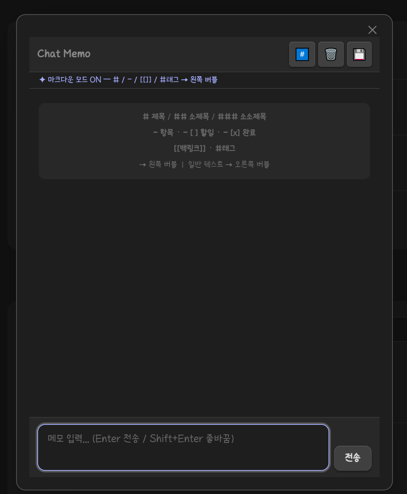

# Chat Memo — Obsidian Plugin

> A chat-style memo plugin for [Obsidian](https://obsidian.md).  
> Type thoughts like a chat message — save them as beautifully structured notes.


---

## ✨ Features

- **Chat-style input UI** — Enter memos in a familiar chat bubble interface
- **Markdown Mode** — Automatically parses and visually distinguishes:
  - `# Heading 1` / `## Heading 2` / `### Heading 3`
  - `- item` bullet lists
  - `- [ ] todo` / `- [x] done` checkboxes
  - `[[Backlink]]` internal links
  - `#tag` hashtags
- **Save to Vault** — Exports your chat session as a well-formatted Markdown note with YAML frontmatter (tags, links, date)
- **Auto-open on startup** — Optionally pop up Chat Memo every time Obsidian launches

---

## 📸 Screenshots



---

## 🚀 Installation

### From Obsidian Community Plugins (Recommended)

1. Open **Settings → Community Plugins**
2. Disable Safe Mode if prompted
3. Click **Browse** and search for **Chat Memo**
4. Click **Install**, then **Enable**

### Manual Installation

1. Download the [latest release](https://github.com/Dec32th/obsidian-chat-memo/releases/latest)
2. Extract `main.js`, `styles.css`, `manifest.json` into your vault at:  
   `.obsidian/plugins/chat-memo/`
3. Reload Obsidian and enable the plugin in **Settings → Community Plugins**

---

## 🎮 Usage

### Opening Chat Memo

- Click the **chat bubble icon** in the left ribbon
- Or use the Command Palette: `Chat Memo: Open popup`

### Input Syntax (Markdown Mode ON)

| Input | Display | Saved as |
|-------|---------|----------|
| `# Title` | H1 bubble (left) | `# Title` |
| `## Sub` | H2 bubble (left) | `## Sub` |
| `### Sub` | H3 bubble (left) | `### Sub` |
| `- item` | Bullet bubble (left) | `- item` |
| `- [ ] task` | Todo bubble (left) | `- [ ] task` |
| `- [x] done` | Done bubble (left) | `- [x] done` |
| `[[Note]]` | Backlink bubble (left) | linked in frontmatter |
| `#tag` | Tag badge (left) | added to frontmatter tags |
| Any other text | Self bubble (right) | `- content` |

> When **Markdown Mode is OFF**, all input is treated as plain text (right bubble).

### Saving Notes

- Click the 💾 button in the toolbar — or press **Escape** / close the modal
- Enter a note title (defaults to today's date)
- Optionally add extra tags (comma-separated, no `#` needed)
- Click **Save** → the note opens instantly in your vault

**Generated frontmatter example:**
```yaml
---
date: 2025-01-15
tags: [idea, project]
links: ["[[SomeNote]]"]
---
```

---

## ⚙️ Settings

| Setting | Default | Description |
|---------|---------|-------------|
| Auto-open on startup | `ON` | Opens Chat Memo popup every time Obsidian launches |
| Markdown Mode | `ON` | Parses `#`, `-`, `[[]]`, `#tag` into styled left-side bubbles |

---

## 🛠 Development

```bash
# Clone the repository
git clone https://github.com/Dec32th/obsidian-chat-memo
cd obsidian-chat-memo

# Install dependencies
npm install

# Build
npm run build

# Dev mode (watch)
npm run dev
```

Copy `main.js`, `styles.css`, `manifest.json` into your vault's plugin folder to test.

---

## 📋 Roadmap

- [ ] Edit / delete individual bubbles
- [ ] Image / file attachment support
- [ ] Export as PDF
- [ ] Multi-session history

---

## 🤝 Contributing

Contributions, issues, and feature requests are welcome!  
Please check the [issues page](https://github.com/Dec32th/obsidian-chat-memo/issues) before opening a new one.

1. Fork the repo
2. Create your branch: `git checkout -b feat/my-feature`
3. Commit your changes: `git commit -m 'feat: add my feature'`
4. Push: `git push origin feat/my-feature`
5. Open a Pull Request

---

## 📄 License

[MIT](LICENSE) © 2026 WHK
